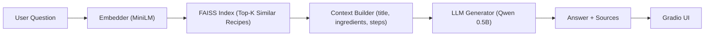

# 🍞 BakeChat RAG — Retrieval-Augmented Recipe Assistant

BakeChat RAG is a mini Retrieval-Augmented Generation (RAG) application that answers recipe-related questions such as ingredient substitutions and preparation steps. It retrieves relevant recipes from a local dataset using FAISS similarity search, then uses a lightweight instruction-tuned LLM (Qwen 0.5B) to generate grounded responses with source citations. A Gradio UI provides an interactive chat-like interface.

---

## 🚀 Key Features

- ✅ FAISS-based semantic recipe retrieval  
- ✅ Detects substitution-type questions (e.g., “replace egg in brownies”)  
- ✅ Generates answers grounded in retrieved recipes  
- ✅ Uses Qwen/Qwen2.5-0.5B-Instruct (CPU-friendly LLM)  
- ✅ Gracefully falls back to summaries when unclear  
- ✅ Gradio UI for easy interaction  
- ✅ Easily extendable to large datasets (Kaggle, RecipeNLG)

---

## 🏗️ System Architecture



# 📂 Project Structure    
```text
bakechat-rag/
├─ README.md                 # This file
├─ Makefile                  # One-command setup, index build, run
├─ requirements.txt          # Dependencies
├─ app.py                    # Gradio UI application
├─ Space.md                  # Notes for future Hugging Face deployment
├─ data/
│  ├─ raw/                   # Raw recipe dataset (demo JSONL)
│  │  └─ recipes.jsonl
│  └─ processed/             # FAISS index + metadata (generated; gitignored)
├─ rag/
│  ├─ __init__.py
│  ├─ build_index.py         # Creates FAISS index
│  ├─ query.py               # Retrieval + generation logic
│  └─ eval_retrieval.py      # Optional evaluation script
├─ prompts/
│  └─ system.txt             # System prompt instructions
└─ assets/
   └─ ui-screenshot.png      # Static UI screenshot (optional)
```


# Quickstart (3 commands)

Requires Python 3.10+ and a terminal (PowerShell on Windows or any Unix shell).

git clone https://github.com/<your-username>/bakechat-rag.git
cd bakechat-rag

# 1) Create venv + install deps
make install

# 2) Build FAISS index from the demo dataset
make build-index

# 3) Launch the Gradio app
make run


Then open the link printed in the terminal (usually http://127.0.0.1:7860).

💡 First run will download models. Subsequent runs are instant thanks to local caching.

# Optional: keep model caches inside the repo

Set a local Hugging Face cache so models live under .cache/huggingface in this project:

- Windows (PowerShell): setx HF_HOME ".cache\huggingface"
Close and reopen your terminal afterward.

- macOS/Linux: export HF_HOME=.cache/huggingface

# 🛠️ Makefile Targets

| Command            | Description                                                           |
| ------------------ | --------------------------------------------------------------------- |
| `make install`     | Create venv and install dependencies                                  |
| `make build-index` | Build FAISS index from `data/raw/recipes.jsonl` into `data/processed` |
| `make run`         | Start the Gradio app (`app.py`)                                       |
| `make refresh`     | Delete `data/processed/` and rebuild the index                        |
| `make lint`        | Ruff lint (if added to `requirements-dev.txt`)                        |
| `make format`      | Black format (if added to `requirements-dev.txt`)                     |
| `make test`        | Run tests if `tests/` exists                                          |
| `make clean`       | Remove Python and tool caches                                         |
                                      |

# Customize input format/file if needed:
make build-index INPUT_FILE=data/raw/recipes.jsonl INPUT_FMT=jsonl


# ⚙️ How the RAG Pipeline Works
| Stage            | What Happens                         |
| ---------------- | ------------------------------------ |
| 🔹 Embedding     | Query converted to vector via MiniLM |
| 🔹 Retrieval     | FAISS fetches top-matching recipes   |
| 🔹 Context Build | Title, ingredients, steps merged     |
| 🔹 Intent Check  | Detects substitution questions       |
| 🔹 Generation    | Qwen LLM produces concise response   |
| 🔹 Citation      | Sources appended as `[Title \| ID]`  |


# 💬 Example Queries
Query	Expected Behavior
“Replace eggs in brownies”	Bullet-style substitutions
“How to make vegan mayonnaise?”	Summarizes steps
“Gluten-free pizza dough method?”	Extracts instructions
“Alternative to milk in pancakes”	Suggests liquid replacements


# 🧠 Models Used
Component	Model
Embedder	sentence-transformers/all-MiniLM-L6-v2
Generator (default)	Qwen/Qwen2.5-0.5B-Instruct
Optional Reranker	cross-encoder/ms-marco-MiniLM-L-6-v2


# 📊 Dataset

    ✅ Current: demo JSONL at data/raw/recipes.jsonl

    📈 Ready to scale to Kaggle/RecipeNLG subsets (replace the file, then run make refresh or make build-index)

# Input format:
newline-delimited JSON (.jsonl) with per-recipe fields that your indexer expects (e.g., title, ingredients, steps, id). No pipeline code changes required when you swap in a larger file; just rebuild the index.

# 🧪 Sanity Checks
- Python 3.10+ available
- Virtual environment created (.venv/)
- Index built successfully in data/processed/
- First run downloads models; later runs start immediately
- App reachable at the printed local URL
If imports fail for rag.*, ensure you run commands from the repo root and that rag/__init__.py exists.

# 🗺️ Roadmap
| Status | Task                                |
| ------ | ----------------------------------- |
| ✅     | Working RAG demo              |
| 🔜     | Add `--limit` to indexer   |
| 🔜     | Scale to partial Kaggle dataset     |
| 🔜     | Optional reranker toggle |
| 🚀     | Deploy to Hugging Face Spaces       |


# 👩‍💻 Author

Crafted by Elnaz as part of an LLM learning journey exploring real-world RAG architectures.


# 📄 License

MIT License – feel free to fork, learn, and extend!